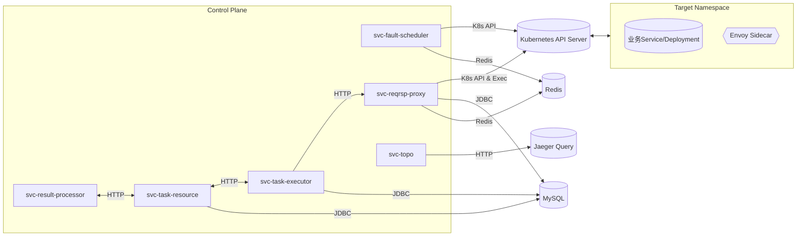

# ChaosBlade Space Exploration

A Spring Boot microservices project for chaos engineering space exploration.

## Overview

This project consists of multiple microservices designed to demonstrate chaos engineering principles and practices. Each service is independently deployable and provides specific functionality within the overall system architecture.

## Architecture

### Services

| Service | Port | Description | Framework |
|---------|------|-------------|-----------|
| svc-task-resource | 8101 | Task resource management service | Spring MVC |
| svc-task-executor | 8102 | Task execution service | Spring MVC |
| svc-fault-scheduler | 8103 | Fault injection scheduler | Spring MVC |
| svc-result-processor | 8104 | Result processing service | Spring MVC |
| svc-reqrsp-proxy | 8105 | Request/Response proxy service | Spring WebFlux |
| svc-topo | 8106 | Topology awareness service | Spring MVC |

### Common Modules

- **common-core**: Shared utilities and common response formats
- **common-test**: Test dependencies and utilities

## Quick Start

### Prerequisites

- Java 21
- Maven 3.6+
- Docker (optional, for infrastructure)

### Building the Project

```bash
# Build all modules
mvn clean compile

# Build and package all services
mvn clean package

# Skip tests during build
mvn clean package -DskipTests
```

### Running Services

Each service can be run independently:

```bash
# Run a specific service
cd svc-task-resource
mvn spring-boot:run

# Or run the packaged JAR
java -jar target/svc-task-resource-1.0.0-SNAPSHOT.jar
```

### Health Check

Each service provides a simple health check endpoint:

```bash
# Check service health
curl http://localhost:8101/hello  # svc-task-resource
curl http://localhost:8102/hello  # svc-task-executor
curl http://localhost:8103/hello  # svc-fault-scheduler
curl http://localhost:8104/hello  # svc-result-processor
curl http://localhost:8105/hello  # svc-reqrsp-proxy
curl http://localhost:8106/hello  # svc-topo
```

Expected response format:
```json
{
  "code": 0,
  "message": "ok",
  "data": "<service-name>: hello world"
}
```


## 环境变量与配置分离（.env 集成）

为避免配置硬编码与敏感信息泄露，项目采用“环境变量 + 配置分离”方案：
- application.yml 中的敏感值统一以占位符形式引用：如 `${DB_URL:jdbc:mysql://localhost:3306/...}`
- 每个服务目录内提供 `.env.example` 模板（无敏感信息），本地复制为 `.env` 并填入真实值（`.env` 已加入 .gitignore，不会提交）
- 启动前在当前服务目录 `set -a; source .env; set +a # 自动为 .env 中的变量加 export`，Spring Boot 即可从进程环境读取变量并替换占位符

### 文件与版本控制
- 已提交的模板文件（示例，无敏感信息）：
  - `svc-task-resource/.env.example`
  - `svc-task-executor/.env.example`
  - `svc-fault-scheduler/.env.example`
  - `svc-reqrsp-proxy/.env.example`
- 本地私有文件（含真实敏感值，已忽略）：
  - `svc-task-resource/.env`
  - `svc-task-executor/.env`
  - `svc-fault-scheduler/.env`
  - `svc-reqrsp-proxy/.env`
- .gitignore 已确保：
  - 任意目录下的 `.env` 被忽略；`.env.example` 会被提交

### 快速上手（每个服务目录执行）
```bash
# 以 svc-task-executor 为例
cd svc-task-executor
cp -n .env.example .env   # 首次使用时复制模板
vi .env                   # 按需填写真实值
source .env               # 加载为当前 shell 的环境变量

# 启动服务
mvn spring-boot:run
# 或使用打包产物
# java -jar target/svc-task-executor-*.jar
```

### 各服务环境变量清单（按需填写）
- svc-task-resource
  - DB_URL, DB_USERNAME, DB_PASSWORD
  - EXTERNAL_TOPOLOGY_BASE_URL（外部拓扑服务），EXECUTOR_BASE_URL（task-executor 服务地址）
  - LLM_API_URL, LLM_API_KEY, LLM_API_MODEL
- svc-task-executor
  - K8S_API_URL, K8S_TOKEN, K8S_VERIFY_SSL
  - DB_URL, DB_USERNAME, DB_PASSWORD
  - PROXY_BASE_URL（指向 svc-reqrsp-proxy），SCHEDULER_BASE_URL（指向 svc-fault-scheduler）
  - RECORDING_TOKEN（如需）、LLM_API_URL, LLM_API_KEY, LLM_API_MODEL
- svc-fault-scheduler
  - REDIS_HOST, REDIS_PORT, REDIS_DB
  - K8S_API_URL, K8S_TOKEN, K8S_VERIFY_SSL
- svc-reqrsp-proxy
  - DB_URL, DB_USERNAME, DB_PASSWORD
  - REDIS_HOST, REDIS_PORT, REDIS_DB
  - K8S_API_URL, K8S_TOKEN, K8S_VERIFY_SSL

> 说明：application.yml 中均已使用占位符（带合理本地默认值），若未提供环境变量，将使用默认值。

### 验证占位符是否生效
1. 在目标服务目录执行 `source .env`
2. 启动服务并访问健康检查/简单接口（如 `/hello`）
3. 查看启动日志或功能是否能正确访问外部依赖（MySQL/Redis/K8s 等）

### 注意事项
- 不要将真实敏感值写入 application.yml；仅在 `.env` 或 CI/CD 的环境变量/Secret 中配置
- `.env` 仅对当前 shell 会话有效（通过 `source`），更换终端需再次加载
- 生产环境推荐使用 Secret 管理（K8s Secret、云端密管或 Vault），通过环境变量注入容器

## Development

### Project Structure

```
chaosblade-space-exploration/
├─ pom.xml                          # Parent aggregator POM
├─ common/
│  ├─ common-core/                  # Shared utilities
│  └─ common-test/                  # Test dependencies
├─ svc-task-resource/               # Task resource service
├─ svc-task-executor/               # Task executor service
├─ svc-fault-scheduler/             # Fault scheduler service
├─ svc-result-processor/            # Result processor service
├─ svc-reqrsp-proxy/                # Proxy service (WebFlux)
├─ svc-topo/                        # Topology service
└─ infra/
   ├─ docker-compose.yml            # Infrastructure setup
   └─ local/mysql-init/             # Database initialization
```

### Technology Stack

- **Java**: 21
- **Spring Boot**: 3.5.5
- **Spring Cloud**: 2024.0.0
- **Build Tool**: Maven
- **Reactive Framework**: Spring WebFlux (proxy service only)

## Contributing

Please read [CONTRIBUTING.md](CONTRIBUTING.md) for details on our code of conduct and the process for submitting pull requests.

## Security

Please read [SECURITY.md](SECURITY.md) for information about reporting security vulnerabilities.

## License

This project is licensed under the Apache License 2.0 - see the [LICENSE](LICENSE) file for details.


## 全量部署与运维指南（推荐阅读）

> 本节覆盖：架构说明、环境依赖、部署方式（本地/Kubernetes/Docker）、运行与验证、开发指南。所有示例默认端口：
> - svc-task-resource 8101 | svc-task-executor 8102 | svc-fault-scheduler 8103 | svc-result-processor 8104 | svc-reqrsp-proxy 8105 | svc-topo 8106

### 架构说明

- 角色与职责
  - svc-task-resource：任务资源与元数据管理（MySQL）
  - svc-task-executor：执行任务编排，调用代理进行录制/拦截/回放
  - svc-fault-scheduler：面向 ChaosBlade 的故障注入编排（Kubernetes CRD + Redis）
  - svc-result-processor：异步结果处理/汇聚
  - svc-reqrsp-proxy：基于 Envoy 的“请求录制/智能拦截/回放”控制面（Kubernetes Exec/ConfigMap/Deployment 打补丁）
  - svc-topo：拓扑可视化与追踪集成（Jaeger）

- 服务间通信（HTTP/JSON）：
  - executor -> reqrsp-proxy：下发“录制/拦截/回放”指令
  - scheduler -> Kubernetes API：创建/删除 ChaosBlade CR；读事件
  - resource/result-processor 与各服务：REST 调用
  - 所有服务对外提供 /hello 健康探活

- 组件关系图（Mermaid）


### 环境依赖与版本
- 语言/框架：Java 21；Spring Boot 3.5.5；Spring Cloud 2024.0.0
- 基础设施：
  - MySQL 8.0+（docker-compose 默认 8.4），建议字符集 utf8mb4
  - Redis 6.2+（docker-compose 默认 7）
  - Kubernetes 1.24+（需支持 Pods/exec WebSocket；RBAC 必须开启）
  - Jaeger（svc-topo 可选，HTTP 16686 或 gRPC 16685）
- 网络与权限：
  - 服务容器需能访问 K8s API（443/6443），并允许 WebSocket（Fabric8 exec 用于在目标 Pod 容器执行命令）
  - RBAC：
    - svc-reqrsp-proxy：pods/get,list,watch; pods/exec; configmaps/get,create,update; deployments/get,patch; services/get,patch; events/get,list
    - svc-fault-scheduler：chaosblade.io/chaosblades get,list,watch,create,delete; events/get,list
  - 建议使用 ServiceAccount + Secret 注入 token，不要将 token 明文放入 application.yml

> 提示：scripts/start-all.sh 仅负责“打包并启动应用”，不启动或初始化 MySQL/Redis，请提前准备好外部实例并通过环境变量进行配置。


### 部署方式

#### 1) 本地开发环境
1. 准备外部基础设施（必需，脚本不负责）
   - 确保有可访问的 MySQL 和 Redis，并记录连接参数（主机、端口、数据库名、账号密码等）
   - 示例：MySQL tcp://127.0.0.1:3306，数据库 spaceexploration；Redis 127.0.0.1:6379
2. 配置环境变量（推荐用环境变量覆盖 application.yml）
   ```bash
   # MySQL
   export DB_HOST=127.0.0.1
   export DB_PORT=3306
   export DB_NAME=spaceexploration
   export DB_USERNAME=youruser
   export DB_PASSWORD=yourpass
   # 也可直接提供完整 URL（优先生效）
   export SPRING_DATASOURCE_URL="jdbc:mysql://$DB_HOST:$DB_PORT/$DB_NAME?useSSL=false&serverTimezone=UTC&allowPublicKeyRetrieval=true"

   # Redis
   export SPRING_DATA_REDIS_HOST=127.0.0.1
   export SPRING_DATA_REDIS_PORT=6379

   # Kubernetes（如需使用录制/拦截/故障注入等需要访问 K8s 的功能）
   export KUBERNETES_API_URL=https://your-apiserver:6443
   export KUBERNETES_TOKEN=$(cat your-token)
   ```
3. 一键启动脚本（仅打包并启动应用；不创建数据库、不启动中间件）
   ```bash
   chmod +x scripts/start-all.sh
   ./scripts/start-all.sh

   # 自定义服务子集
   SERVICES="svc-reqrsp-proxy svc-topo" ./scripts/start-all.sh
   ```
4. 手动方式（可选）
   ```bash
   mvn -T1C -DskipTests package
   cd svc-reqrsp-proxy && mvn spring-boot:run
   # 或使用打包产物
   # java -jar svc-reqrsp-proxy/target/svc-reqrsp-proxy-*.jar
   ```

#### 2) Kubernetes 集群部署（示例）
- 推荐做法：使用 ConfigMap/Secret + 环境变量配置 Spring；每个服务一个 Deployment + Service；给 proxy/scheduler 绑定所需 RBAC。
- RBAC（proxy 最小示例）：
```yaml
apiVersion: v1
kind: ServiceAccount
metadata:
  name: reqrsp-proxy-sa
  namespace: chaosblade
---
apiVersion: rbac.authorization.k8s.io/v1
kind: ClusterRole
metadata:
  name: reqrsp-proxy-role
rules:
- apiGroups: [""]
  resources: ["pods","pods/exec","configmaps","services","events"]
  verbs: ["get","list","watch","create","update","patch"]
- apiGroups: ["apps"]
  resources: ["deployments"]
  verbs: ["get","list","watch","patch"]
---
apiVersion: rbac.authorization.k8s.io/v1
kind: ClusterRoleBinding
metadata:
  name: reqrsp-proxy-binding
roleRef:
  apiGroup: rbac.authorization.k8s.io
  kind: ClusterRole
  name: reqrsp-proxy-role
subjects:
- kind: ServiceAccount
  name: reqrsp-proxy-sa
  namespace: chaosblade
```
- 部署（以 svc-reqrsp-proxy 为例，关键环境变量）：
```yaml
apiVersion: apps/v1
kind: Deployment
metadata:
  name: svc-reqrsp-proxy
  namespace: chaosblade
spec:
  replicas: 1
  selector:
    matchLabels: {app: svc-reqrsp-proxy}
  template:
    metadata:
      labels: {app: svc-reqrsp-proxy}
    spec:
      serviceAccountName: reqrsp-proxy-sa
      containers:
      - name: app
        image: ghcr.io/your-org/svc-reqrsp-proxy:1.0.0
        ports: [{containerPort: 8105}]
        env:
        - name: SPRING_DATASOURCE_URL
          valueFrom: {secretKeyRef: {name: app-db, key: url}}
        - name: DB_USERNAME
          valueFrom: {secretKeyRef: {name: app-db, key: username}}
        - name: DB_PASSWORD
          valueFrom: {secretKeyRef: {name: app-db, key: password}}
        - name: SPRING_DATA_REDIS_HOST
          value: redis.svc.cluster.local
        - name: KUBERNETES_API_URL
          value: https://kubernetes.default.svc
        - name: KUBERNETES_TOKEN
          valueFrom: {secretKeyRef: {name: k8s-api-token, key: token}}
---
apiVersion: v1
kind: Service
metadata:
  name: svc-reqrsp-proxy
  namespace: chaosblade
spec:
  selector: {app: svc-reqrsp-proxy}
  ports:
  - port: 8105
    targetPort: 8105
    protocol: TCP
```
- 拓扑服务（已有示例）：见 svc-topo/k8s/k8s.yaml

#### 3) Docker 容器化（通用 Dockerfile 模板）
```dockerfile
# syntax=docker/dockerfile:1
FROM eclipse-temurin:21-jre AS run
WORKDIR /app
ARG JAR=target/app.jar
COPY ${JAR} app.jar
ENV JAVA_OPTS="-XX:+UseContainerSupport -XX:MaxRAMPercentage=70"
EXPOSE 8105
ENTRYPOINT ["sh","-c","java $JAVA_OPTS -jar app.jar"]
```
构建示例：
```bash
mvn -pl svc-reqrsp-proxy -am -DskipTests package
docker build -t ghcr.io/your-org/svc-reqrsp-proxy:1.0.0 -f svc-reqrsp-proxy/Dockerfile svc-reqrsp-proxy
```

### 运行与验证
- 启动顺序建议：
  1) 基础设施 MySQL/Redis/Jaeger
  2) svc-task-resource → svc-reqrsp-proxy → svc-fault-scheduler → svc-task-executor → svc-result-processor → svc-topo
- 健康检查：
  ```bash
  curl http://<host>:8101/hello
  ...
  curl http://<host>:8106/hello
  ```
- 代理功能快速测试（svc-reqrsp-proxy：智能拦截 API）：
  ```bash
  # 添加拦截（自动判断是否在录制，不在则仅拦截）
  curl -X POST http://<proxy-host>:8105/api/interceptions/start \
    -H 'Content-Type: application/json' -d '{
      "namespace":"train-ticket","serviceName":"ts-preserve-service",
      "interceptionRules":[{"method":"GET","path":"/api/v1/orders"}]}'

  # 查询拦截状态
  curl http://<proxy-host>:8105/api/interceptions/session/<sessionId>/status
  ```
- 故障注入（svc-fault-scheduler）：
  ```bash
  # 执行故障（传 spec 或完整 CR JSON）
  curl -X POST "http://<fs-host>:8103/api/faults/execute?name=test-net-delay&durationSec=60" \
    -H 'Content-Type: application/json' -d '{"spec":{"experiments":[{"scope":"container","target":"network","action":"delay","matchers":[{"name":"namespace","value":["train-ticket"]}]}]}}'

  # 查询状态
  curl http://<fs-host>:8103/api/faults/test-net-delay/status
  ```
- 日志与排障：
  - 统一查看容器日志：kubectl logs -f deploy/<name> -n <ns>
  - Envoy 拦截问题：查看 proxy 的诊断接口 /api/interceptions/session/{id}/diagnose
  - K8s 权限问题：describe ClusterRole/Binding；API 403 即 RBAC 不足

### 配置与参数（模板）
- 核心环境变量（建议用 Secret 注入敏感信息）
  - SPRING_DATASOURCE_URL / DB_USERNAME / DB_PASSWORD
  - SPRING_DATA_REDIS_HOST / SPRING_DATA_REDIS_PORT
  - KUBERNETES_API_URL / KUBERNETES_TOKEN（集群内可用 ServiceAccount 自动挂载）
  - PROXY_BASE_URL（executor → proxy）
- 代理录制/拦截高级参数（svc-reqrsp-proxy application.yml）
  - recording.envoy.image、port、admin-port、tap-dir、default-duration-sec、auto-collect-interval-sec

### 开发指南
- 构建
  ```bash
  mvn -T1C -DskipTests package
  ```
- 单元与集成测试
  ```bash
  # 全量测试
  mvn -T1C test
  # 指定模块
  mvn -pl svc-reqrsp-proxy test
  ```
- 开发建议
  - 使用环境变量覆盖 application.yml 中的外部依赖地址，避免把真实地址/凭据提交到仓库
  - 针对与 Kubernetes 交互的功能，在非集群环境下可通过 Mock Service 或开关位关闭（如 verify-ssl、超时、重试参数）
