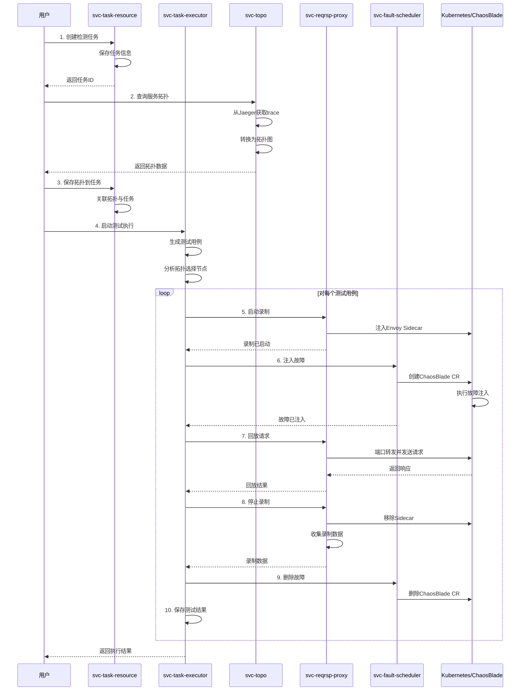
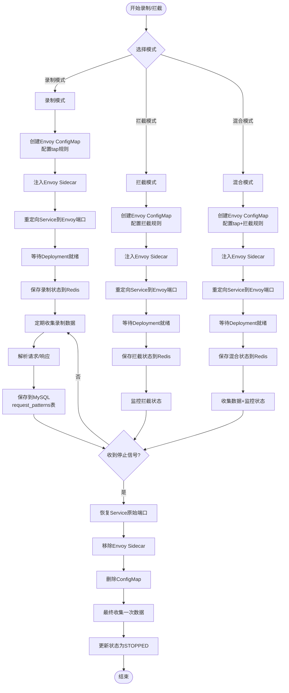
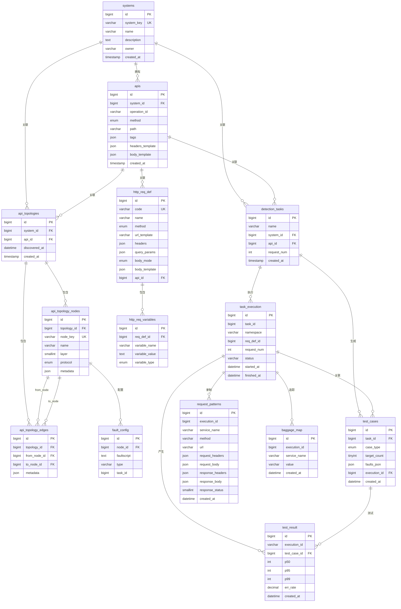

# 第二节：功能模块设计

## 2.1 核心功能列表

本项目是一个基于混沌工程的微服务故障检测与测试平台，核心功能按重要性排序如下：

1. **任务资源管理** - 管理系统、API、检测任务等核心业务资源的生命周期
2. **拓扑发现与可视化** - 基于OpenTelemetry追踪数据自动发现服务调用拓扑并可视化展示
3. **请求录制与模式分析** - 通过Envoy代理录制微服务间的HTTP请求并分析请求模式
4. **智能拦截与响应模拟** - 在服务调用链路中智能拦截请求并返回预定义响应
5. **测试用例生成** - 基于拓扑结构和算法自动生成故障注入测试用例
6. **故障注入调度** - 通过ChaosBlade在Kubernetes集群中注入各类故障
7. **任务执行编排** - 编排完整的测试流程，包括录制、分析、故障注入、回放等
8. **请求回放** - 将录制的请求模式重放到目标服务进行测试
9. **结果处理与分析** - 异步处理测试结果并生成性能指标和分析报告

## 2.2 各模块的详细设计

### 2.2.1 任务资源管理模块 (svc-task-resource)

**模块职责**：
- 管理系统（System）、API、检测任务（DetectionTask）等核心业务实体
- 提供HTTP请求定义（HttpReqDef）的CRUD操作
- 管理API拓扑结构（ApiTopology、ApiTopologyNode、ApiTopologyEdge）
- 提供故障配置（FaultConfig）和SLO配置的管理
- 聚合查询测试用例和测试结果

**核心类/组件**：
- `SystemService` / `SystemRepository` - 系统管理
- `ApiService` / `ApiRepository` - API管理
- `DetectionTaskService` / `DetectionTaskRepository` - 检测任务管理
- `HttpReqDefService` / `HttpReqDefRepository` - HTTP请求定义管理
- `ApiTopologyService` / `ApiTopologyRepository` - 拓扑管理
- `FaultConfigService` / `FaultConfigRepository` - 故障配置管理

**关键功能**：
1. 系统注册与管理：支持创建、查询、更新、删除系统信息
2. API定义管理：管理系统下的API接口定义，包括路径、方法、参数等
3. 检测任务管理：创建和管理故障检测任务，关联系统和API
4. 拓扑数据持久化：存储和查询服务调用拓扑结构
5. 故障配置管理：为拓扑节点配置故障注入脚本
6. 测试数据聚合：聚合查询测试用例和测试结果

**对外接口**：
- `GET/POST /api/systems` - 系统管理
- `GET/POST /api/systems/{systemId}/apis` - API管理
- `GET/POST /api/detection-tasks` - 检测任务管理
- `GET/POST /api/http-req-defs` - HTTP请求定义管理
- `GET/POST /api/topologies` - 拓扑管理
- `GET/POST /api/fault-configs` - 故障配置管理

**依赖关系**：
- 数据库：MySQL（存储所有业务数据）
- 外部依赖：Spring Boot、Spring Data JPA、Hibernate

### 2.2.2 拓扑发现与可视化模块 (svc-topo)

**模块职责**：
- 从Jaeger查询OpenTelemetry追踪数据
- 将追踪数据转换为服务调用拓扑图
- 提供拓扑可视化的Web界面
- 支持拓扑数据的缓存和自动刷新
- 提供API查询和拓扑查询功能

**核心类/组件**：
- `TraceParserService` - 解析Jaeger追踪数据
- `TopologyConverterService` - 将追踪数据转换为拓扑图
- `TopologyAutoRefreshService` - 自动刷新拓扑数据
- `TopologyCacheService` - 拓扑数据缓存管理
- `ApiQueryService` - API查询服务
- `JaegerQueryService` - Jaeger数据查询服务

**关键功能**：
1. 追踪数据解析：解析OpenTelemetry Jaeger格式的trace数据
2. 拓扑图构建：使用JGraphT构建三级实体模型（Namespace/Service/Pod -> RPC）
3. RED指标计算：计算Rate（请求速率）、Error（错误率）、Duration（延迟）指标
4. 拓扑可视化：提供React + XFlow的Web界面展示拓扑图
5. 自动刷新：支持每15秒自动从Jaeger查询最新数据并更新拓扑
6. 拓扑缓存：基于时间区间的拓扑数据缓存，提高查询性能
7. API查询：根据命名空间和服务筛选API列表
8. 拓扑查询：根据API ID查询上下游拓扑关系

**对外接口**：
- `POST /api/trace/upload` - 上传trace文件
- `POST /api/trace/generate` - 基于JSON生成拓扑
- `GET /api/xflow/topology` - 获取XFlow格式拓扑数据
- `GET /api/xflow/auto-refresh/status` - 获取自动刷新状态
- `POST /api/xflow/auto-refresh/trigger` - 手动触发刷新
- `POST /api/apis/end2end` - 查询API列表
- `POST /api/topology/byapi` - 根据API查询拓扑

**依赖关系**：
- Jaeger：查询追踪数据
- JGraphT：图结构处理
- React + XFlow：前端可视化
- Spring Boot、Jackson：后端框架

### 2.2.3 请求录制与代理模块 (svc-reqrsp-proxy)

**模块职责**：
- 通过Envoy Sidecar录制微服务间的HTTP请求和响应
- 智能拦截请求并返回预定义响应
- 支持录制、拦截、混合三种模式
- 管理录制状态和拦截规则
- 提供请求模式的存储和查询

**核心类/组件**：
- `RecordingService` - 录制服务管理
- `InterceptionService` - 拦截服务管理
- `HybridService` - 混合模式（录制+拦截）管理
- `ReplayService` - 请求回放服务
- `K8sTapManager` - Kubernetes资源管理（ConfigMap、Deployment、Service）
- `TapCollector` - 从Envoy收集录制数据
- `TemplateBasedTapConfigRenderer` - 渲染Envoy配置
- `RecordingStateService` - 录制状态管理（Redis）
- `RequestPatternRepository` - 请求模式数据访问

**关键功能**：
1. 录制启动：创建Envoy ConfigMap，注入Sidecar，重定向Service流量
2. 录制停止：移除Sidecar，恢复Service，收集录制数据
3. 智能拦截：检测服务状态，基于现有配置添加拦截规则或启动独立拦截模式
4. 混合模式：同时支持录制和拦截功能
5. 数据采集：定期从Envoy Sidecar的/tap目录收集录制的请求/响应数据
6. 请求模式存储：将录制的请求解析并存储到MySQL
7. 请求回放：基于execution_id查询请求模式并通过端口转发重放到目标服务
8. 状态管理：使用Redis管理录制/拦截会话状态

**对外接口**：
- `POST /api/recordings/start` - 开始录制
- `POST /api/recordings/{recordingId}/stop` - 停止录制
- `GET /api/recordings/{recordingId}/status` - 查询录制状态
- `POST /api/interceptions/start` - 智能添加拦截
- `POST /api/interceptions/session/{sessionId}/stop` - 停止拦截
- `POST /api/hybrid/start` - 启动混合模式
- `POST /api/request-patterns/replay` - 请求回放
- `GET /api/request-patterns/execution/{executionId}` - 查询请求模式

**依赖关系**：
- Kubernetes API：管理ConfigMap、Deployment、Service
- Envoy Proxy：作为Sidecar录制和拦截流量
- Redis：存储录制状态
- MySQL：存储请求模式数据
- Spring WebFlux：响应式Web框架

### 2.2.4 故障注入调度模块 (svc-fault-scheduler)

**模块职责**：
- 通过ChaosBlade在Kubernetes集群中注入故障
- 管理ChaosBlade自定义资源（CR）的生命周期
- 支持多种故障类型（CPU、内存、网络、磁盘、进程等）
- 提供故障状态查询和事件监控
- 使用Redis管理故障元数据和TTL

**核心类/组件**：
- `FaultsService` - 故障执行和管理服务
- `ChaosBladeApi` - ChaosBlade Kubernetes API封装
- `SpecNormalizer` - 故障规范标准化和验证
- `FaultRedisRepo` - Redis故障数据仓库
- `FaultsController` - 故障管理REST控制器

**关键功能**：
1. 故障执行：接收故障定义JSON，创建ChaosBlade CR，注入故障
2. 故障删除：删除ChaosBlade CR，清理故障
3. 故障查询：查询ChaosBlade资源状态和事件
4. 故障列表：列出所有活跃故障
5. TTL管理：支持设置故障持续时间，自动调度删除
6. 规范验证：验证故障定义的合法性
7. 事件监控：查询ChaosBlade相关的Kubernetes事件

**对外接口**：
- `POST /api/faults/execute` - 执行故障注入
- `DELETE /api/faults/{bladeName}` - 删除故障
- `GET /api/faults/{bladeName}` - 查询故障状态
- `GET /api/faults` - 列出所有故障

**依赖关系**：
- Kubernetes API：管理ChaosBlade CR
- ChaosBlade Operator：执行实际的故障注入
- Redis：存储故障元数据和TTL
- kubectl：通过命令行创建CR（绕过序列化问题）

### 2.2.5 任务执行编排模块 (svc-task-executor)

**模块职责**：
- 编排完整的故障检测测试流程
- 生成测试用例并执行
- 协调录制、分析、故障注入、回放等步骤
- 管理任务执行状态和日志
- 计算和存储测试结果

**核心类/组件**：
- `ExecutionOrchestrator` - 执行编排器
- `TestCaseGenerationService` - 测试用例生成服务
- `TestExecutionService` - 测试执行服务
- `TopologyLayerService` - 拓扑层次分析服务
- `KubernetesService` - Kubernetes集成服务
- `TaskExecutionRepository` - 任务执行数据访问
- `TestCaseRepository` - 测试用例数据访问
- `TestResultRepository` - 测试结果数据访问

**关键功能**：
1. 测试用例生成：基于拓扑结构和算法生成0/1/2故障的测试用例
2. 拓扑分析：计算SCC（强连通分量）、DAG压缩、路径覆盖、节点评分
3. 节点选择：选择叶子节点、分支点、高分节点作为故障注入目标
4. 请求模式分析：调用svc-reqrsp-proxy分析叶子节点的请求模式
5. 录制启动：为涉及故障的服务启动录制
6. 故障注入：调用svc-fault-scheduler注入故障
7. 请求回放：调用svc-reqrsp-proxy回放请求
8. 结果收集：收集拦截结果和性能指标
9. 批量执行：支持批量执行所有测试用例
10. 状态管理：管理任务执行的各个阶段状态
11. 日志记录：记录执行过程的详细日志

**对外接口**：
- `GET /api/detection-tasks/{taskId}/test-cases` - 获取测试用例
- `GET /api/detection-tasks/{taskId}/test-cases/step1` - 获取节点选择结果
- `POST /api/detection-tasks/{taskId}/pattern-analysis` - 启动模式分析
- `POST /api/detection-tasks/{taskId}/execution` - 启动测试执行
- `POST /api/detection-tasks/{taskId}/execution/with-recording` - 带录制的执行
- `POST /api/detection-tasks/{taskId}/execution/batch` - 批量执行
- `GET /api/detection-tasks/{taskId}/layers` - 获取拓扑层次

**依赖关系**：
- svc-task-resource：查询任务、拓扑、故障配置
- svc-reqrsp-proxy：录制、拦截、回放
- svc-fault-scheduler：故障注入
- Kubernetes API：查询Pod、Service状态
- MySQL：存储执行记录、测试用例、测试结果

### 2.2.6 结果处理模块 (svc-result-processor)

**模块职责**：
- 异步处理测试执行结果
- 汇聚和分析性能指标
- 生成测试报告
- 提供结果查询接口

**核心类/组件**：
- `ResultProcessorApplication` - 应用入口

**关键功能**：
1. 异步结果处理：异步处理测试执行产生的结果数据
2. 指标汇聚：汇聚P50、P95、P99延迟和错误率等指标
3. 报告生成：生成测试报告和分析结论

**对外接口**：
- `GET /hello` - 健康检查

**依赖关系**：
- MySQL：查询测试结果数据
- Spring Boot：基础框架

### 2.2.7 公共模块 (common)

**模块职责**：
- 提供跨服务共享的工具类和通用组件
- 定义统一的响应格式和异常处理

**核心类/组件**：
- `common-core`：
  - `ApiResponse` - 统一API响应格式
  - `PageResponse` - 分页响应格式
  - `BusinessException` - 业务异常
- `common-test`：
  - 测试依赖和工具类

**关键功能**：
1. 统一响应格式：提供`{success, data, error}`格式的API响应
2. 异常处理：统一的业务异常处理机制
3. 分页支持：通用的分页响应格式

**对外接口**：
无（作为依赖库被其他模块使用）

**依赖关系**：
- Jackson：JSON序列化
- Spring Boot：基础框架

## 2.3 业务流程图

### 2.3.1 完整故障检测流程



### 2.3.2 请求录制与拦截流程



### 2.3.3 测试用例生成算法流程

```mermaid
flowchart TD
    Start([开始生成测试用例]) --> LoadTopo[加载拓扑数据<br/>nodes + edges]
    LoadTopo --> BuildGraph[构建有向图]
    
    BuildGraph --> FindSCC[查找强连通分量SCC]
    FindSCC --> CompressDAG[压缩为DAG]
    
    CompressDAG --> CalcPaths[计算每个节点的<br/>in_paths和out_paths]
    CalcPaths --> CalcScore[计算节点分数<br/>score = in_paths × out_paths]
    
    CalcScore --> SelectNodes{选择关键节点}
    SelectNodes -->|叶子节点| Leaf[out_degree = 0]
    SelectNodes -->|分支点| Branch[out_degree > 1]
    SelectNodes -->|高分节点| TopK[score排名前K]
    
    Leaf --> MergeNodes[合并选中节点]
    Branch --> MergeNodes
    TopK --> MergeNodes
    
    MergeNodes --> CalcCoverage[计算路径覆盖率]
    CalcCoverage --> CheckCoverage{覆盖率达标?}
    
    CheckCoverage -->|否| AddMore[添加更多高分节点]
    AddMore --> MergeNodes
    
    CheckCoverage -->|是| LoadFaultConfig[加载故障配置]
    LoadFaultConfig --> GenBaseline[生成基线用例<br/>0故障]
    
    GenBaseline --> GenSingle[生成单故障用例<br/>每个选中节点1个]
    GenSingle --> DetermineReplicas{判断副本数}
    
    DetermineReplicas -->|replicas > 1| UseCountMode[使用count=1模式<br/>期望: OK_200_OR_AFTER_RETRY]
    DetermineReplicas -->|replicas = 1| UseKillAllMode[使用killMode=all模式<br/>期望: FAST_5XX_OR_TIMEOUT]
    
    UseCountMode --> GenDual
    UseKillAllMode --> GenDual[生成双故障用例<br/>C(n,2)组合]
    
    GenDual --> SortCases[排序: 单故障 -> 基线 -> 双故障]
    SortCases --> SaveCases[保存测试用例]
    SaveCases --> End([结束])
```

## 2.4 数据库设计

### 2.4.1 ER图



### 2.4.2 核心表结构详细说明

#### 1. systems - 系统表

存储被测系统的基本信息。

| 字段名 | 类型 | 约束 | 说明 |
|--------|------|------|------|
| id | bigint | PK, AUTO_INCREMENT | 主键ID |
| system_key | varchar(64) | UNIQUE, NOT NULL | 系统唯一标识（对应K8s namespace） |
| name | varchar(255) | NOT NULL | 系统名称 |
| description | text | NULL | 系统描述 |
| owner | varchar(64) | NULL | 系统负责人 |
| default_environment | varchar(64) | NULL | 默认环境 |
| created_at | timestamp | NOT NULL, DEFAULT CURRENT_TIMESTAMP | 创建时间 |
| updated_at | timestamp | NOT NULL, DEFAULT CURRENT_TIMESTAMP ON UPDATE | 更新时间 |

**索引**：
- PRIMARY KEY (id)
- UNIQUE KEY uk_systems_system_key (system_key)
- KEY idx_systems_owner (owner)

#### 2. apis - API定义表

存储系统的API接口定义。

| 字段名 | 类型 | 约束 | 说明 |
|--------|------|------|------|
| id | bigint | PK, AUTO_INCREMENT | 主键ID |
| system_id | bigint | FK, NOT NULL | 所属系统ID |
| operation_id | varchar(128) | NOT NULL | OpenAPI operationId |
| method | enum | NOT NULL | HTTP方法（GET/POST/PUT/DELETE等） |
| path | varchar(512) | NOT NULL | API路径 |
| summary | varchar(512) | NULL | API摘要 |
| tags | json | NULL | 标签数组 |
| version | varchar(64) | NULL | API版本 |
| base_url | varchar(512) | NULL | 基础URL（协议+主机+端口） |
| content_type | varchar(64) | NOT NULL, DEFAULT 'application/json' | 请求Content-Type |
| headers_template | json | NULL | 请求头模板 |
| auth_type | enum | NOT NULL, DEFAULT 'NONE' | 认证类型 |
| auth_template | json | NULL | 认证配置 |
| path_params | json | NULL | 路径参数定义 |
| query_params | json | NULL | 查询参数定义 |
| body_template | json | NULL | 请求体模板 |
| variables | json | NULL | 变量定义数组 |
| timeout_ms | int | NOT NULL, DEFAULT 15000 | 超时时间（毫秒） |
| retry_config | json | NULL | 重试策略 |
| created_at | timestamp | NOT NULL, DEFAULT CURRENT_TIMESTAMP | 创建时间 |
| updated_at | timestamp | NOT NULL, DEFAULT CURRENT_TIMESTAMP ON UPDATE | 更新时间 |

**索引**：
- PRIMARY KEY (id)
- UNIQUE KEY uk_apis_system_op (system_id, operation_id)
- KEY idx_apis_system (system_id)
- KEY idx_apis_method_path (method, path)
- FOREIGN KEY fk_apis_system (system_id) REFERENCES systems(id) ON DELETE CASCADE

#### 3. detection_tasks - 检测任务表

存储故障检测任务的配置信息。

| 字段名 | 类型 | 约束 | 说明 |
|--------|------|------|------|
| id | bigint | PK, AUTO_INCREMENT | 主键ID |
| name | varchar(255) | NOT NULL | 任务名称 |
| description | text | NULL | 任务描述 |
| system_id | bigint | FK, NOT NULL | 关联系统ID |
| api_id | bigint | FK, NOT NULL | 关联API ID |
| created_by | varchar(64) | NOT NULL | 创建人 |
| updated_by | varchar(64) | NULL | 更新人 |
| created_at | timestamp | NOT NULL, DEFAULT CURRENT_TIMESTAMP | 创建时间 |
| updated_at | timestamp | NULL, DEFAULT CURRENT_TIMESTAMP ON UPDATE | 更新时间 |
| archived_at | datetime | NULL | 归档时间 |
| fault_configurations_id | bigint | NULL | 故障配置ID |
| slo_id | bigint | NULL | SLO配置ID |
| request_num | int | NOT NULL | 单次测试请求数 |
| api_definition_id | int | NULL | API定义ID |

**索引**：
- PRIMARY KEY (id)
- KEY idx_tasks_system (system_id)
- KEY idx_tasks_api (api_id)
- KEY idx_tasks_created_at (created_at)
- FOREIGN KEY fk_tasks_system (system_id) REFERENCES systems(id) ON DELETE RESTRICT
- FOREIGN KEY fk_tasks_api (api_id) REFERENCES apis(id) ON DELETE RESTRICT

#### 4. api_topologies - API拓扑表

存储服务调用拓扑的元数据。

| 字段名 | 类型 | 约束 | 说明 |
|--------|------|------|------|
| id | bigint | PK, AUTO_INCREMENT | 主键ID |
| system_id | bigint | FK, NOT NULL | 关联系统ID |
| api_id | bigint | FK, NOT NULL | 关联API ID |
| discovered_at | datetime | NOT NULL | 拓扑发现时间 |
| source_version | varchar(64) | NULL | 源版本或哈希 |
| notes | text | NULL | 备注 |
| created_at | timestamp | NOT NULL, DEFAULT CURRENT_TIMESTAMP | 创建时间 |

**索引**：
- PRIMARY KEY (id)
- KEY idx_topologies_api (api_id, discovered_at)
- KEY idx_topologies_system (system_id)
- FOREIGN KEY fk_topologies_system (system_id) REFERENCES systems(id) ON DELETE CASCADE
- FOREIGN KEY fk_topologies_api (api_id) REFERENCES apis(id) ON DELETE CASCADE

#### 5. api_topology_nodes - 拓扑节点表

存储拓扑图中的服务节点。

| 字段名 | 类型 | 约束 | 说明 |
|--------|------|------|------|
| id | bigint | PK, AUTO_INCREMENT | 主键ID |
| topology_id | bigint | FK, NOT NULL | 所属拓扑ID |
| node_key | varchar(128) | NOT NULL | 节点唯一标识 |
| name | varchar(255) | NOT NULL | 节点名称（服务名） |
| layer | smallint | NOT NULL, DEFAULT 1 | 拓扑层次 |
| protocol | enum | NOT NULL, DEFAULT 'HTTP' | 协议类型（HTTP/gRPC/DB/MQ/OTHER） |
| metadata | json | NULL | 附加元数据 |

**索引**：
- PRIMARY KEY (id)
- UNIQUE KEY uk_nodes_topology_nodekey (topology_id, node_key)
- KEY idx_nodes_topology (topology_id)
- KEY idx_nodes_layer (layer)
- FOREIGN KEY fk_nodes_topology (topology_id) REFERENCES api_topologies(id) ON DELETE CASCADE

#### 6. api_topology_edges - 拓扑边表

存储拓扑图中的服务调用关系。

| 字段名 | 类型 | 约束 | 说明 |
|--------|------|------|------|
| id | bigint | PK, AUTO_INCREMENT | 主键ID |
| topology_id | bigint | FK, NOT NULL | 所属拓扑ID |
| from_node_id | bigint | FK, NOT NULL | 源节点ID |
| to_node_id | bigint | FK, NOT NULL | 目标节点ID |
| metadata | json | NULL | 附加元数据（如调用次数、延迟等） |

**索引**：
- PRIMARY KEY (id)
- KEY idx_edges_topology (topology_id)
- KEY idx_edges_from_to (from_node_id, to_node_id)
- FOREIGN KEY fk_edges_topology (topology_id) REFERENCES api_topologies(id) ON DELETE CASCADE
- FOREIGN KEY fk_edges_from_node (from_node_id) REFERENCES api_topology_nodes(id) ON DELETE CASCADE
- FOREIGN KEY fk_edges_to_node (to_node_id) REFERENCES api_topology_nodes(id) ON DELETE CASCADE

#### 7. fault_config - 故障配置表

存储节点的故障注入配置。

| 字段名 | 类型 | 约束 | 说明 |
|--------|------|------|------|
| id | bigint | PK, AUTO_INCREMENT | 主键ID |
| node_id | bigint | FK, NOT NULL | 关联节点ID |
| faultscript | text | NOT NULL | 故障脚本（ChaosBlade定义） |
| type | varchar(30) | NULL | 故障类型 |
| task_id | bigint | NULL | 关联任务ID |

**索引**：
- PRIMARY KEY (id)
- KEY idx_node_id (node_id)
- FOREIGN KEY fk_faultcfg_node (node_id) REFERENCES api_topology_nodes(id) ON DELETE CASCADE ON UPDATE CASCADE

#### 8. task_execution - 任务执行表

存储任务执行的状态和元数据。

| 字段名 | 类型 | 约束 | 说明 |
|--------|------|------|------|
| id | bigint | PK, AUTO_INCREMENT | 执行ID |
| task_id | bigint | NOT NULL | 业务任务ID |
| namespace | varchar(128) | NOT NULL | Kubernetes命名空间 |
| req_def_id | bigint | NULL | 请求定义ID |
| request_num | int | NOT NULL, DEFAULT 1 | 入口并发数 |
| status | varchar(32) | NOT NULL, DEFAULT 'INIT' | 执行状态 |
| analyze_task_id | varchar(64) | NULL | 分析任务ID |
| record_id | bigint | NULL | 录制批次ID |
| intercept_record_id | varchar(64) | NULL | 拦截记录ID |
| started_at | datetime | NOT NULL, DEFAULT CURRENT_TIMESTAMP | 开始时间 |
| finished_at | datetime | NULL | 结束时间 |
| error_code | varchar(64) | NULL | 错误码 |
| error_msg | text | NULL | 错误信息 |
| created_at | datetime | NOT NULL, DEFAULT CURRENT_TIMESTAMP | 创建时间 |
| updated_at | datetime | NOT NULL, DEFAULT CURRENT_TIMESTAMP ON UPDATE | 更新时间 |

**状态枚举**：INIT / GENERATING_CASES / ANALYZING_PATTERNS / RECORDING_READY / INJECTING_AND_REPLAYING / RULES_READY / LOAD_TEST_BASELINE / DONE / FAILED

**索引**：
- PRIMARY KEY (id)
- KEY idx_task (task_id)
- KEY idx_status (status)
- KEY idx_record (record_id)
- KEY idx_intercept_record (intercept_record_id)

#### 9. test_cases - 测试用例表

存储生成的测试用例定义。

| 字段名 | 类型 | 约束 | 说明 |
|--------|------|------|------|
| id | bigint | PK, AUTO_INCREMENT | 主键ID |
| task_id | bigint | FK, NOT NULL | 关联检测任务ID |
| case_type | enum | NOT NULL | 用例类型（BASELINE/SINGLE/DUAL） |
| target_count | tinyint | NOT NULL | 目标数量（0/1/2） |
| faults_json | json | NOT NULL | 故障定义快照 |
| created_at | datetime | NOT NULL, DEFAULT CURRENT_TIMESTAMP | 创建时间 |
| execution_id | bigint | NULL | 关联执行ID |

**索引**：
- PRIMARY KEY (id)
- KEY idx_detection_task_id (task_id)
- FOREIGN KEY fk_tc_detection_task (task_id) REFERENCES detection_tasks(id) ON DELETE CASCADE ON UPDATE CASCADE
- CHECK CONSTRAINT chk_target_count (target_count IN (0,1,2))

#### 10. test_result - 测试结果表

存储测试执行的性能指标。

| 字段名 | 类型 | 约束 | 说明 |
|--------|------|------|------|
| id | bigint | PK, AUTO_INCREMENT | 主键ID |
| execution_id | varchar(64) | NOT NULL | 执行ID |
| test_case_id | bigint | NOT NULL | 测试用例ID |
| p50 | int | NULL | P50延迟（毫秒） |
| p95 | int | NULL | P95延迟（毫秒） |
| p99 | int | NULL | P99延迟（毫秒） |
| err_rate | decimal(5,2) | NULL | 错误率（0-100） |
| request_url | text | NULL | 请求URL |
| request_method | varchar(10) | NULL | 请求方法 |
| response_code | int | NULL | 响应码 |
| response_body | longtext | NULL | 响应体 |
| created_at | datetime | NOT NULL, DEFAULT CURRENT_TIMESTAMP | 创建时间 |

**索引**：
- PRIMARY KEY (id)
- KEY idx_exec_case (execution_id, test_case_id)

#### 11. request_patterns - 请求模式表

存储录制的HTTP请求和响应模式。

| 字段名 | 类型 | 约束 | 说明 |
|--------|------|------|------|
| id | bigint | PK, AUTO_INCREMENT | 主键ID |
| execution_id | bigint | NOT NULL | 执行ID |
| service_name | varchar(200) | NOT NULL | 服务名 |
| method | varchar(16) | NOT NULL | HTTP方法 |
| url | varchar(2048) | NOT NULL | 完整URL路径 |
| request_headers | json | NULL | 请求头 |
| request_body | json | NULL | 请求体 |
| response_headers | json | NULL | 响应头 |
| response_body | json | NULL | 响应体 |
| response_status | smallint | NOT NULL | HTTP响应码 |
| created_at | datetime | NOT NULL, DEFAULT CURRENT_TIMESTAMP | 创建时间 |
| updated_at | datetime | NOT NULL, DEFAULT CURRENT_TIMESTAMP ON UPDATE | 更新时间 |

**索引**：
- PRIMARY KEY (id)
- KEY idx_task (execution_id)
- KEY idx_service (service_name)
- KEY idx_task_service (execution_id, service_name)
- KEY idx_method_url (method, url(255))
- KEY idx_status (response_status)

#### 12. http_req_def - HTTP请求定义表

存储可复用的HTTP请求模板。

| 字段名 | 类型 | 约束 | 说明 |
|--------|------|------|------|
| id | bigint | PK, AUTO_INCREMENT | 主键ID |
| code | varchar(64) | UNIQUE, NOT NULL | 请求定义编码 |
| name | varchar(128) | NOT NULL | 名称 |
| method | enum | NOT NULL | HTTP方法 |
| url_template | varchar(1024) | NOT NULL | URL模板（支持{var}占位符） |
| headers | json | NULL | 请求头模板 |
| query_params | json | NULL | 查询参数模板 |
| body_mode | enum | NOT NULL, DEFAULT 'NONE' | 请求体模式（NONE/JSON/FORM/RAW） |
| content_type | varchar(128) | NULL | Content-Type |
| body_template | json | NULL | 请求体模板（JSON/FORM） |
| raw_body | mediumtext | NULL | 原始请求体（RAW模式） |
| created_at | timestamp | NOT NULL, DEFAULT CURRENT_TIMESTAMP | 创建时间 |
| updated_at | timestamp | NOT NULL, DEFAULT CURRENT_TIMESTAMP ON UPDATE | 更新时间 |
| api_id | bigint | NULL | 所属API ID |

**索引**：
- PRIMARY KEY (id)
- UNIQUE KEY code (code)
- KEY idx_method (method)

#### 13. baggage_map - 追踪上下文表

存储分布式追踪的baggage信息，用于故障注入的上下文传递。

| 字段名 | 类型 | 约束 | 说明 |
|--------|------|------|------|
| id | bigint | PK, AUTO_INCREMENT | 主键ID |
| execution_id | bigint | NOT NULL | 执行ID |
| service_name | varchar(200) | NOT NULL | 服务名 |
| value | varchar(1024) | NOT NULL | baggage值（如chaos.f1=...） |
| created_at | datetime | NOT NULL, DEFAULT CURRENT_TIMESTAMP | 创建时间 |

**索引**：
- PRIMARY KEY (id)
- UNIQUE KEY uk_exec_service (execution_id, service_name)
- KEY idx_service (service_name)

#### 14. fault_types - 故障类型字典表

存储支持的故障类型定义。

| 字段名 | 类型 | 约束 | 说明 |
|--------|------|------|------|
| fault_type_id | bigint | PK, AUTO_INCREMENT | 主键ID |
| fault_code | varchar(64) | UNIQUE, NOT NULL | 故障类型编码 |
| name | varchar(255) | NOT NULL | 故障名称 |
| description | text | NULL | 故障描述 |
| category | varchar(64) | NOT NULL | 故障分类（CPU/Memory/Disk/Network/Process/Internal） |
| enabled | tinyint(1) | NOT NULL, DEFAULT 1 | 是否启用 |
| display_order | int | NOT NULL, DEFAULT 0 | 展示顺序 |
| param_config | json | NOT NULL | 参数配置定义 |
| created_at | timestamp | NOT NULL, DEFAULT CURRENT_TIMESTAMP | 创建时间 |
| updated_at | timestamp | NOT NULL, DEFAULT CURRENT_TIMESTAMP ON UPDATE | 更新时间 |

**索引**：
- PRIMARY KEY (fault_type_id)
- UNIQUE KEY uk_fault_code (fault_code)
- KEY idx_category_enabled (category, enabled)

### 2.4.3 数据存储说明

#### MySQL数据库

本项目使用MySQL作为主要的关系型数据库，存储以下类型的数据：

1. **业务元数据**：系统、API、检测任务等核心业务实体
2. **拓扑数据**：服务调用拓扑的节点和边
3. **配置数据**：故障配置、SLO配置、HTTP请求定义等
4. **执行数据**：任务执行记录、测试用例、测试结果
5. **录制数据**：请求模式、拦截结果等

#### Redis缓存

svc-reqrsp-proxy和svc-fault-scheduler使用Redis存储临时状态：

1. **录制状态**（svc-reqrsp-proxy）：
   - Key格式：`recording:state:{recordingId}`
   - 存储内容：RecordingState对象（JSON序列化）
   - TTL：根据durationSec设置

2. **故障元数据**（svc-fault-scheduler）：
   - Key格式：`fault:{bladeName}`
   - 存储内容：故障定义、状态、创建时间等
   - TTL：根据durationSec设置
   - 索引Key：`fault:index`（Set类型，存储所有bladeName）

#### Kubernetes资源

部分配置和状态存储在Kubernetes资源中：

1. **ConfigMap**：Envoy代理配置（svc-reqrsp-proxy）
2. **ChaosBlade CR**：故障注入定义（svc-fault-scheduler）
3. **Deployment**：Envoy Sidecar注入状态

#### 文件系统

1. **Envoy录制数据**：临时存储在Envoy容器的`/tmp/envoy-taps`目录
2. **应用日志**：各服务的运行日志

---

**文档版本**：1.0
**最后更新**：2025-11-03
**维护者**：开发团队

